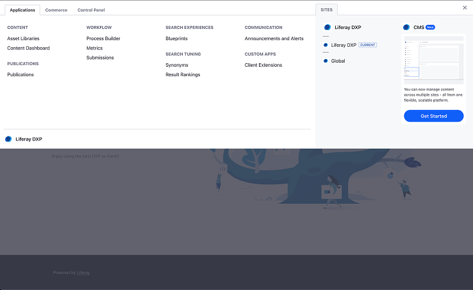

# Liferay Headless Blog - Next.js Sample

This [Next.js](https://nextjs.org) template consumes [Liferay's](https://www.liferay.com/) CMS Blog headless APIs. For more information, read [Getting Started with Liferay](https://learn.liferay.com/w/dxp/getting-started).

 ## Prerequisites

- Git
- Node.js 22+
- Liferay Portal 2025.Q4+

## Clone the Template

1. Run the following command in your terminal:

    ```bash
    curl -sL https://raw.githubusercontent.com/liferay/liferay-portal/master/modules/integrations/vercel/clone_template.sh | bash -s -- blog
    ```

1. Navigate to the repository directory:

    ```bash
    cd blog
    ```

## Setup your Local Liferay Instance

!!! important
    Currently, this feature is behind a beta feature flag (LPD-17564) and also depends on release feature flags (LPD-32050 and LPD-34594). Read [Feature Flags](https://learn.liferay.com/w/dxp/security-and-administration/administration/configuring-liferay/feature-flags) for more information.

1. Log in with your email to the Liferay instance at [http://localhost:8080](http://localhost:8080)

1. Open the Global Menu () and navigate to CMS.

    

1. Click *Get Started* and follow the on-screen instructions to create a new Space.

The new CMS feature uses "Spaces" as the primary container for headless content.

## Add the Service Access Policy

Liferay restricts some APIs access by default for security. You must configure a [Service Access Policy](https://learn.liferay.com/w/dxp/security-and-administration/security/securing-web-services/setting-service-access-policies) to allow public access to the necessary endpoints.

1. Navigate to Control Panel &rarr; Security &rarr; Service Access Policies.

1. Click the *`OBJECT_DEFAULT`* policy.

1. In the Allowed Service Signatures section, add a new row with the following values:

    - Service Class: `com.liferay.object.rest.internal.resource.v1_0.ObjectEntryResourceImpl`
    - Method Name: `getScopeScopeKeyPage`

1. Click Save.

## Grant Guest Permissions

Once the API is exposed via policy, you must ensure unauthenticated users ([Guests](https://learn.liferay.com/w/dxp/security-and-administration/users-and-permissions/users)) can view the content.

1. Follow the steps in [Defining Role Permissions](https://learn.liferay.com/w/dxp/security-and-administration/users-and-permissions/roles-and-permissions/defining-role-permissions) to access the permissions interface.

1. Grant the `View` permission to the Guest role.

## Run the Template

1. Install the dependencies:

    ```bash
    npm install
    ```

1. Configure your environment variables:

    ```bash
    cp .env.example .env
    ```

1. Open `.env` and define the following keys:

   - `LIFERAY_HOST`: Your Liferay instance URL (`http://localhost:8080` for local development).
   - `LIFERAY_SPACE_ID`: Your CMS Space ID (also known as Group ID, or Scope ID).

    !!! note
        You can retrieve your Space ID in the Space settings. See [Configuring Spaces](https://learn.liferay.com/w/dxp/content-management-system/liferay-headless-content-management-system/spaces/configuring-spaces) to learn more.


1. (Optional) Add a sample Blog content to your Space for testing. See [creating content](https://learn.liferay.com/w/dxp/content-management-system/liferay-headless-content-management-system/assets/creating-assets-and-folders).

1. Start the development server:

    ```bash
    npm run dev
    ```

1. Open [http://localhost:3000](http://localhost:3000) in your browser.

You can now edit `app/page.tsx` to modify the page. The application auto-updates as you edit the file.

## Learn More

- [Foundations of Liferay Headless APIs](https://learn.liferay.com/l/29393515)
- [Mastering Consuming Liferay Headless APIs](https://learn.liferay.com/l/29852017)
- [Learn Next.js](https://nextjs.org/learn)
