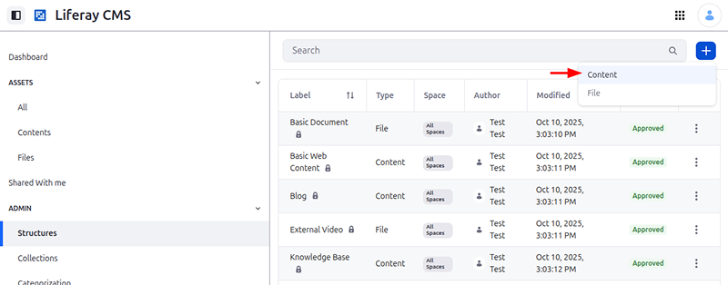
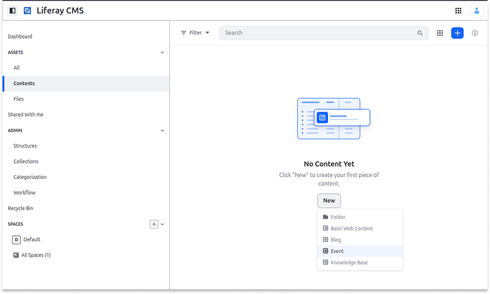

# Liferay Headless Content Page - Next.js Sample

This [Next.js](https://nextjs.org) template consumes [Liferay's](https://www.liferay.com/) CMS Content Page headless APIs. For more information, read [Getting Started with Liferay](https://learn.liferay.com/w/dxp/getting-started).

## Prerequisites

-   Git
-   Node.js 22+
-   Liferay Portal 2025.Q4+

## Set Up Your Template

1. Run this command: 

   ```bash
   curl -sL https://raw.githubusercontent.com/liferay/liferay-portal/master/modules/integrations/vercel/clone_template.sh | bash -s -- content-page
   ```

1. Navigate to the repository directory:

   ```bash
   cd content-page
   ```

## Set Up Your Local Liferay Instance

1. Log into the Liferay instance at [http://localhost:8080](http://localhost:8080)

## Creating an Event Structure

Liferay provides some predefined content structures, but you can create your own.

!!! important
    Currently, this feature is behind a beta feature flag ([LPD-17564](https://liferay.atlassian.net/browse/LPD-17564)) and also depends on release feature flags ([LPD-32050](https://liferay.atlassian.net/browse/LPD-32050) and [LPD-34594](https://liferay.atlassian.net/browse/LPD-34594)). Read [Feature Flags](https://learn.liferay.com/w/dxp/security-and-administration/administration/configuring-liferay/feature-flags) for more information.

1. Go to the Structures page in Liferay CMS Dashboard and click *Add* () &rarr; *Content*.

   

1. Under the General tab, edit the Structure Name field and check the box to make it available for all spaces.

1. Fill in these fields:

| Name              |   Type    | Localizable |
| ----------------- | :-------: | ----------: |
| Availability      |   Text    |          No |
| Content           |   Text    |         Yes |
| Image             |  Upload   |          No |
| Location Map Url  |   Text    |          No |
| Location Name     |   Text    |          No |
| Main Event        |  Boolean  |           - |
| Registration Link |   Text    |          No |
| Summary           | Long Text |         Yes |
| Title             |   Text    |         Yes |
| Virtual           |  Boolean  |           - |

1. Click *Publish*.

## Creating an Event

1. Go to the Contents tab under Assets.

1. Click *New* &rarr; *Event*.

   

1. Select the Content Structure.

1. Choose the Space for the content.

1. Click *Save*

## Add the Service Access Policy

Liferay restricts API access by default for security. You must configure a [Service Access Policy](https://learn.liferay.com/w/dxp/security-and-administration/security/securing-web-services/setting-service-access-policies) to allow access to the necessary endpoints.

1. Navigate to Control Panel &rarr; Security &rarr; Service Access Policies.

1. Click the *OBJECT_DEFAULT* policy.

1. In the Allowed Service Signatures section, add a new row with the following values:

    - Service Class: `com.liferay.object.rest.internal.resource.v1_0.ObjectEntryResourceImpl`
    - Method Name: `getScopeScopeKeyPage`

1. Click *Save*.

## Grant Guest Permissions

Once the API is exposed via policy, you must ensure unauthenticated users ([Guests](https://learn.liferay.com/w/dxp/security-and-administration/users-and-permissions/users)) can view the content.

1. Follow the steps in [Defining Role Permissions](https://learn.liferay.com/w/dxp/security-and-administration/users-and-permissions/roles-and-permissions/defining-role-permissions) to access the permissions interface.

1. Grant the `View` permission to the Guest role.

## Run the Template

1. Install the dependencies:

   ```bash
   npm install
   ```

1. Configure your environment variables:

   ```bash
   cp .env.example .env
   ```

1. Open `.env` and define the following keys:

   - `LIFERAY_HOST`: your Liferay instance URL (`http://localhost:8080` for local development)
   - `LIFERAY_SPACE_ID`: your CMS Space ID (also known as Group ID, or Scope ID)
   - `LIFERAY_LANGUAGES`: the available languages that you can consume to extract data to display (e.g.: `en_US,es_ES,pt_BR`)
   - `LIFERAY_CONTENT_PATH`: your content path, including ID

   If you are using a custom structure, follow this pattern: `/o/c/[structure_name]/scopes/[space_id]` (e.g., `/o/c/events/scopes/35367`).

1. Start the development server:

   ```bash
   npm run dev
   ```

1. Open [http://localhost:3000](http://localhost:3000) in your browser.

You can now edit `app/page.tsx` to modify the page. The application auto-updates as you edit the file.

## Learn More

- [Foundations of Liferay Headless APIs](https://learn.liferay.com/l/29393515)
- [Mastering Consuming Liferay Headless APIs](https://learn.liferay.com/l/29852017)
- [Learn Next.js](https://nextjs.org/learn)
